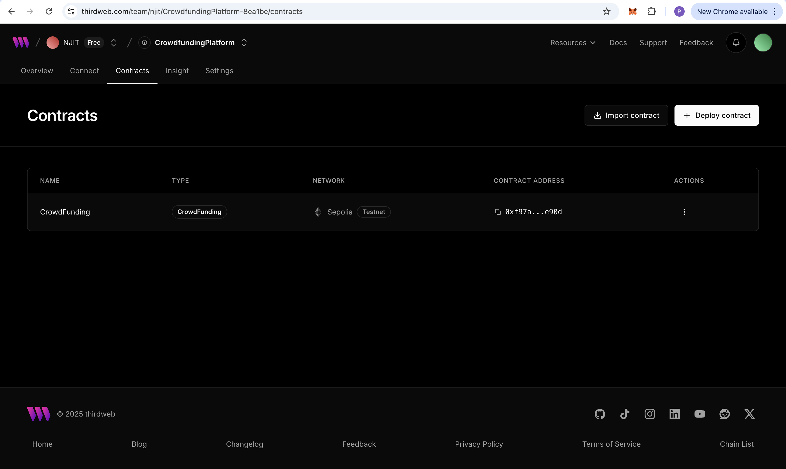
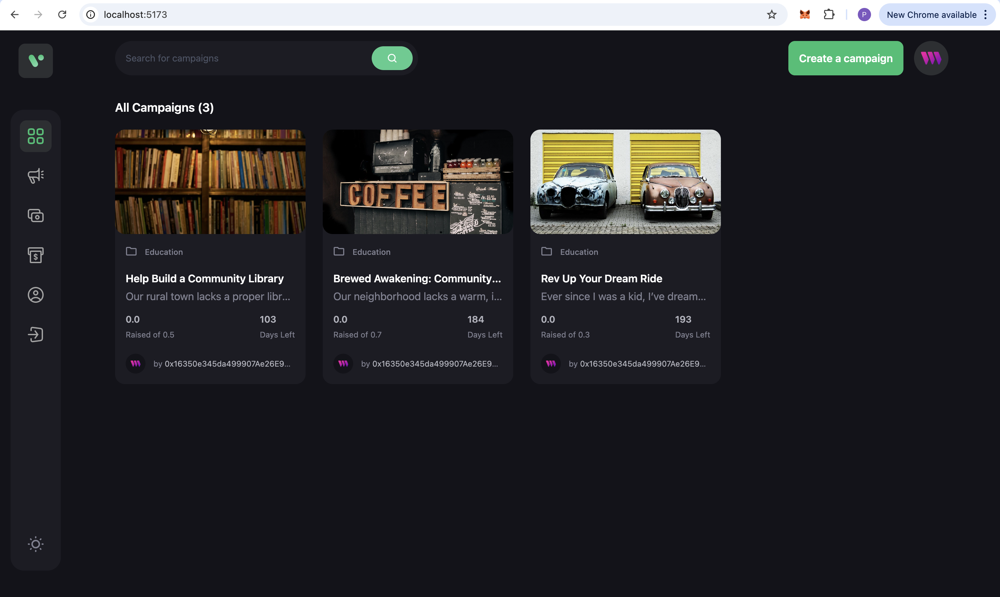

# Crowd Funding dApp

A decentralized crowdfunding application built with React, TypeScript, Tailwind CSS, and thirdweb. Users can create campaigns, view campaign details, and fund campaigns on the blockchain (using testnets like Sepolia).

## Table of Contents

- [Features](#features)
- [Technologies](#technologies)
- [Prerequisites](#prerequisites)
- [Running the Project](#running-the-project)
- [Preview](#preview)

## Features

- **Campaign Creation:** Users can create new crowdfunding campaigns.
- **Campaign Details:** View campaign progress, creator info, story, and list of donators.
- **Fund Campaigns:** Contribute funds (using test ETH) to campaigns.
- **Responsive UI:** Built with Tailwind CSS for a modern, responsive design.
- **Blockchain Integration:** Uses thirdweb SDK and ethers.js to interact with deployed smart contracts.
- **TypeScript:** Entire codebase is written in TypeScript for better maintainability and type safety.

## Technologies

- **Frontend:** React, TypeScript, React Router, Tailwind CSS, Vite
- **Blockchain:** thirdweb SDK, ethers.js, Solidity smart contracts
- **Deployment Tools:** Hardhat (for contract compilation/deployment), thirdweb CLI
- **Test Network:** Sepolia (with test ETH from a faucet)

## Prerequisites

- **Node.js:** LTS version (e.g., v18.x recommended)
- **npm** or **yarn**
- **MetaMask:** Browser extension configured for the correct testnet (e.g., Sepolia)
- **Thirdweb Account:** For deploying and managing smart contracts

## Running the Project

1. **Clone the Repository**

   ```bash
   git clone https://github.com/yourusername/crowd-funding.git
   cd crowd-funding
   ```

2. Install Dependencies

    ```bash
    cd web3
    npm install
    ```

    ```bash
    cd client
    npm install
    ```

2. **Deploy Smart Contract**

    ```bash
    cd web3
    npx thirdweb deploy -k yourThirdwebSecretKey
    ```

3. ** Start Development Server**

    ```bash
    cd client
    npm run dev
    ```

    The app will be available at http://localhost:5173.

5.  **Using the App**
	-	Navigate through pages (Home, Profile, Create Campaign, Campaign Details).
	-	Connect your wallet using MetaMask (ensure it’s on the correct network, e.g., Sepolia).
	-	Create campaigns, view details, and fund campaigns.

## Preview



<br><br>
   


